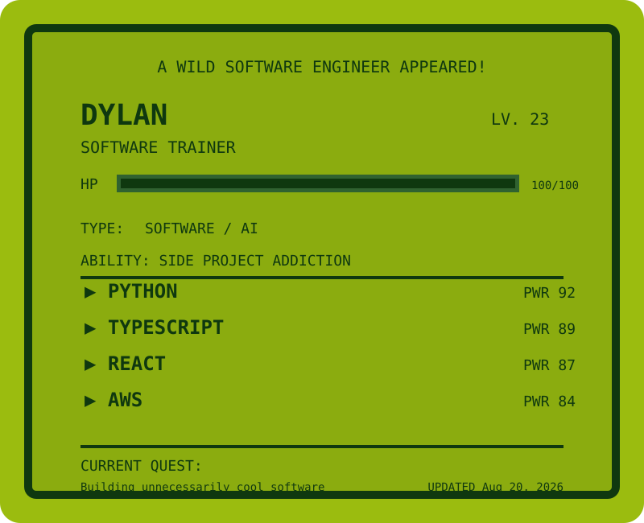
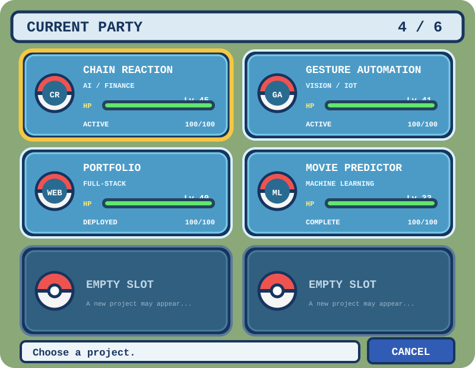
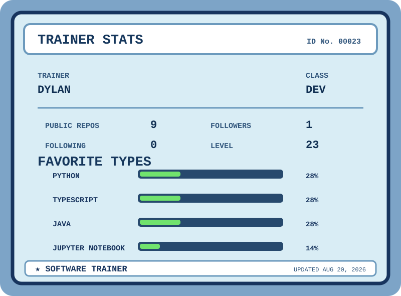

# 🎮 A wild Dylan appeared!

<p align="center">
  
</p>

---

## 🎒 Current Party

<p align="center">
  
</p>

| Project | Type | Status |
|---|---|---|
| [Chain Reaction](https://github.com/dylanflaum08/chain-reaction.git) | 🤖 AI / 📈 Finance | 🟢 Active |
| Gesture Home Automation | 👁️ Computer Vision / IoT | 🟢 Active |
| [Portfolio](https://dyfla.com) | ⚛️ Full-Stack Web | 🟢 Deployed |
| Movie Predictor | 🧠 Machine Learning | ✅ Completed |

---

## 🧠 Pokédex

### Languages


### Frameworks


### Cloud


---

## 🏅 Gym Badges

```text
🟠 Software Engineering
🟣 Artificial Intelligence
🟡 AWS / Cloud
🔵 Full-Stack Development
🟢 Automation
🔴 Computer Vision
```

---

## 📊 Trainer Stats

<p align="center">
  
</p>

---

## 🌎 Trainer Links

<p align="center">

[🌐 Portfolio](https://dyfla.com) • [💼 LinkedIn](YOUR_LINKEDIN_URL)

</p>

---

<p align="center">
  <i>Thanks for stopping by the Pokémon Center.</i>
</p>